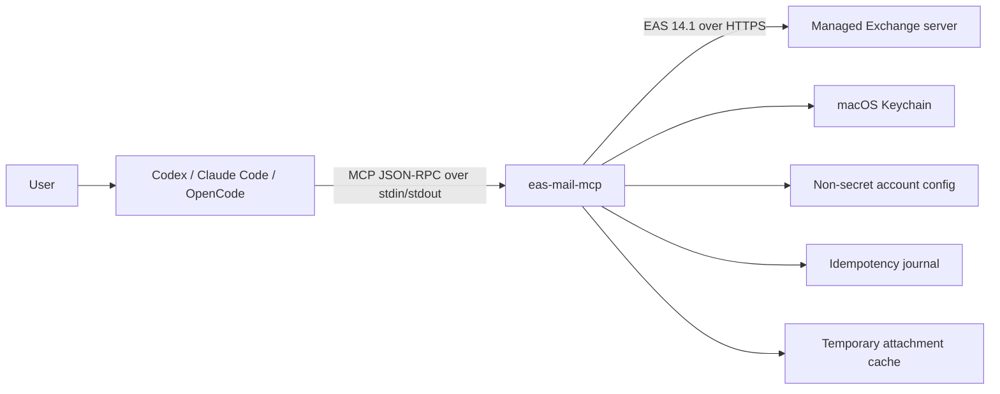
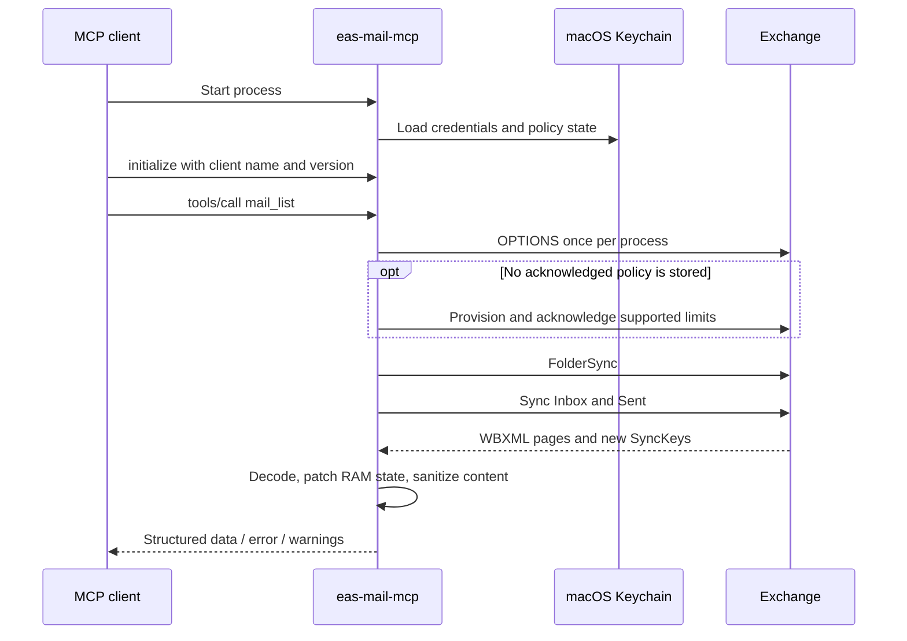

# EAS Mail MCP


`eas-mail-mcp` is a local Rust MCP server for Exchange ActiveSync 14.1. It gives
supported AI clients structured mail tools and read-only calendar tools without
a daemon, GUI, mailbox database, or runtime endpoint configuration.

Endpoint profiles are validated and embedded at build time. The public tree
ships only a non-routable `example.invalid` development profile. Operators can
build deployments from a local ignored profile bundle without adding server
names, trust anchors, or realm information to Git.

## How it works

The simplest mental model is a local, typed API adapter. An AI client speaks
MCP, while Exchange speaks EAS. The binary translates between the two without
running a hosted service of its own.



Each MCP client launches its own `eas-mail-mcp serve` process. There is no
daemon and no mailbox database. The process stays alive for the MCP session,
keeps synchronization state in RAM, and exits with the client.

### Terms for application developers

| Term | Practical mental model |
| --- | --- |
| MCP tool | A typed endpoint such as `mail_list` or `mail_send` |
| EAS | The Exchange API used for mail and calendar synchronization |
| WBXML | A compact binary representation of the XML messages used by EAS |
| SyncKey | A server-issued version cursor: "changes since this state" |
| `mail_ref` / `event_ref` | A short-lived process-local handle, not a database ID |
| Cursor | A pointer into one immutable in-memory result snapshot |

### Example read path

For a request such as "show my latest mail", the client calls `mail_list`:



`mail_list` refreshes Inbox and Sent unless explicit `folder_ids` are supplied.
`sync_now` can refresh every selected collection. Lists return metadata and a
short plain-text preview; `mail_get` fetches the full body only when requested,
and attachments require separate list and download calls. `mail_search` always
searches Exchange instead of a local index.

The first request in a new process is a cold synchronization. Later requests in
the same process can reuse FolderSync and collection SyncKeys, so they usually
transfer fewer records. Restarting the process intentionally discards that
state.

### State and storage

| Location | Stored data |
| --- | --- |
| Compiled binary | Allowed endpoint profiles and optional trust anchors |
| `config.toml` | Profile key, email, username, enabled state, write permission |
| macOS Keychain | Password, Device ID, policy state, journal HMAC key |
| Process RAM | Folders, SyncKeys, mail/event data, references, cursors |
| SQLite | Content-free idempotency metadata for write operations only |
| Cache directory | Explicitly downloaded attachments, retained for up to 24 hours |

RAM references and cursors expire after 15 minutes and cannot be shared between
independent Codex, Claude Code, or OpenCode processes. A new list or search call
creates a new immutable snapshot, capped at 100 returned records per page.

### Write safety

Mail writes are disabled per account by default. A write also requires a known
interactive client version and a caller-provided UUID `idempotency_key`. Before
contacting Exchange, the process records a payload HMAC and `pending` state in
SQLite. Reusing the same UUID with different input is rejected.

Read requests may retry transient network failures. Mail mutations are not
blindly retried: if the connection fails after a request may have reached
Exchange, the result is `OUTCOME_UNKNOWN` rather than a possible duplicate
message. Client-side `ask` rules provide a confirmation UI, but are not an
authentication boundary; see [Security](SECURITY.md) for the full threat model.

### Repository map

- [`crates/app`](crates/app) contains the CLI, MCP tools, runtime, Keychain,
  references, attachment cache, and idempotency journal.
- [`crates/eas`](crates/eas) contains strict HTTPS transport, EAS commands,
  protocol parsing, and the WBXML codec.
- [`crates/profile`](crates/profile) validates build-time deployment profiles.
- [`crates/harness`](crates/harness) provides a scripted Exchange transport and
  black-box stdio MCP tests.
- [`xtask`](xtask) owns repeatable quality, security, profile, bundle, golden,
  performance, and soak commands.

Mail and calendar content is marked as `untrusted_external_content`. The MCP
does not execute it, load remote images, or treat message text as instructions.
Once a tool result is returned, however, the AI client may include it in model
context, so deployment still requires an appropriate data-handling policy.

## MCP tools

Read tools:

- `accounts_list`, `folders_list`, `sync_status`, `sync_now`
- `mail_list`, `mail_search`, `mail_get`
- `mail_list_attachments`, `mail_download_attachment`
- `calendar_list`, `calendar_search`, `calendar_get`

Write tools:

- `mail_mark_read`, `mail_send`, `mail_reply`, `mail_forward`

Writes are disabled per account by default. Every write requires a UUID
`idempotency_key`; a content-free SQLite journal prevents blind replay after an
ambiguous network result. Passwords, Device IDs, policy state, and the journal
HMAC key are stored in macOS Keychain.

`mail_list` synchronizes Inbox and Sent when `folder_ids` is omitted. Other mail
folders remain available through explicit `folder_ids`, while `sync_now` still
refreshes every collection in the requested scope.

## Build the example

Requirements are macOS 14+ and the Rust toolchain pinned in
`rust-toolchain.toml`.

```bash
cargo xtask profile verify
cargo build --locked --release --package eas-mail-mcp
cargo xtask test
```

The example binary is functional but cannot connect to a real endpoint. Release
bundles deliberately reject `development_only` profiles.

## Build a deployment

Create a local `.private/profile.toml` from
[`profile.example.toml`](profile.example.toml), then verify and build it:

```bash
cargo xtask profile verify --profile-bundle .private/profile.toml --release
cargo xtask build-bundles --profile-bundle .private/profile.toml
```

The command emits architecture-specific archives plus one
`eas-mail-mcp-<version>-macos-handoff.tar.gz`. The handoff contains both macOS
architectures, internal checksums, and instructions for a local coding agent;
the installer selects the current architecture. See the
[Russian installation guide](docs/installation.ru.md) for the one-file flow.

`.private/` is ignored in full. Profiles are compile-time input only: the
runtime does not read `.env`, profile TOML, certificate files, or endpoint
variables. See [Build-time profiles](docs/build-time-profiles.md) for the schema
and [Security](SECURITY.md) for the trust boundary.

## Engineering gates

```bash
./scripts/bootstrap-tools.sh
cargo xtask check
cargo xtask public-audit
cargo xtask goldens verify
```

The harness covers WBXML, EAS pagination and policy handling, TLS failures,
idempotent writes, MCP stdio framing, cursor expiry, and subprocess resilience.
See [CONTRIBUTING.md](CONTRIBUTING.md) and
[architecture.md](docs/architecture.md).

## License

Licensed under either of Apache License, Version 2.0 or MIT license at your
option.
