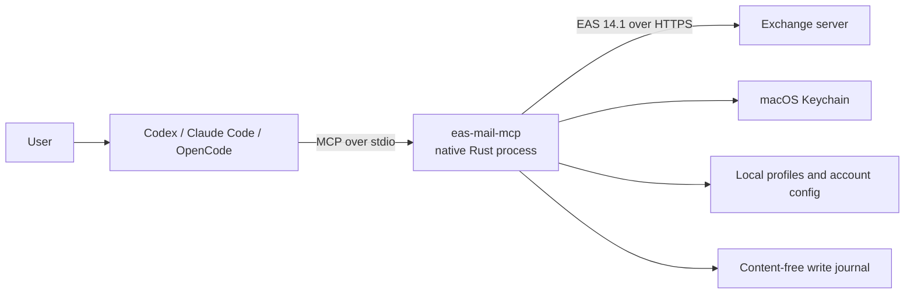

# EAS Mail MCP


`eas-mail-mcp` is a local, native MCP server that gives AI agents structured
access to mail and calendars on Exchange ActiveSync 14.1 servers. It is designed
for managed or on-premises Exchange environments where EAS is available and a
hosted connector, Microsoft Graph, or a local mailbox database is undesirable.

The public npm packages contain no operator server, domain, realm, certificate,
account, or password. Endpoint profiles are created or imported locally, and
credentials stay in macOS Keychain.

```bash
npm install -g eas-mail-mcp
eas-mail-mcp setup
```

[Setup guide](docs/getting-started.md) | [Инструкция на русском](docs/installation.ru.md) | [Security](SECURITY.md)

## What it does

The server exposes bounded, typed tools instead of handing an agent a raw
mailbox export.

| Area | Capabilities |
| --- | --- |
| Mail | List folders and recent messages, search Exchange, fetch one body or attachment on demand |
| Mail actions | Mark as read, send, reply, and forward with idempotent write protection |
| Personal agenda | Return a compact, body-free schedule for a date range, including expanded recurrences and exceptions |
| Availability | Resolve people, read 30-minute free/busy states, and calculate common working-hour slots in Rust |
| Calendar details | Search events and fetch one selected event with its body, attendees, recurrence, and exceptions |
| Calendar actions | Create, update, delete, or cancel events and respond to meeting invitations |
| Multiple accounts | Work with several independently configured EAS profiles and return partial results with warnings |

Typical requests include:

- "Show important unread mail from today."
- "Find a one-hour slot that is free for these participants next week."
- "Show my agenda for tomorrow without meeting bodies."
- "Draft a reply, show it to me, and send it only after I approve the text."

The MCP executes write tools immediately when an agent calls them. Writes are
disabled per account by default, so review and approval behavior should also be
defined in the AI client's operating instructions.

## Why this design

This project is not a universal replacement for every mail integration. Its
advantages are specific to local EAS deployments:

| Compared with | What this project provides | Trade-off |
| --- | --- | --- |
| Hosted mail MCP or relay | Direct local connection from the user's Mac to Exchange; no additional service receives mailbox data | The AI client still receives requested content and must be approved for corporate data |
| IMAP/SMTP integration | Mail, directory resolution, free/busy, calendar details, and meeting lifecycle through one Exchange protocol | Requires an EAS 14.1 endpoint with Basic Auth enabled |
| Microsoft Graph integration | No Entra app registration, OAuth flow, or cloud tenant dependency | Graph is the better fit when modern OAuth and Graph are available or required |
| Local mailbox index | No persistent mailbox database, lower data-at-rest exposure, and fresh server-side search | No offline search; cold requests depend on Exchange and network latency |
| Raw EAS scripts | Stable MCP schemas, strict TLS, WBXML validation, bounded responses, sanitization, and idempotent writes | The supported EAS surface is intentionally narrower than a full mail client |

The native Rust runtime has no GUI, daemon, hosted component, or Node.js process
in the active MCP connection. As a reference, the `0.2.0` acceptance run on one
Apple Silicon Mac measured 9.1 ms startup p95, 15.4 MiB idle RSS per process,
and a 7.9 MB stripped binary. These are environment-specific measurements, not
cross-machine guarantees.

## How it works

Each MCP client starts `eas-mail-mcp serve` over stdio. The process translates
typed MCP calls into EAS commands, validates WBXML responses, performs calendar
and slot calculations, and returns compact structured results.



There is one lightweight process per active MCP connection. Process-local mail
state, cursors, and opaque references live in RAM and disappear when the client
closes the connection. Full message bodies and attachments are fetched only on
request. SQLite stores only idempotency metadata for writes, not mailbox or
calendar content.

Calendar availability never exposes another person's meeting subjects or
bodies. `calendar_find_slots` performs participant resolution, timezone and DST
handling, working-hour filtering, and interval intersection inside the Rust
process. A personal agenda is also filtered and reduced before it reaches the
agent.

For the protocol and module-level explanation, see
[Architecture](docs/architecture.md).

## Quick start

Requirements:

- macOS 14 or later on Apple Silicon or Intel;
- Node.js 18 or later for npm installation and the administrative launcher;
- an Exchange ActiveSync 14.1 endpoint using Basic Auth over TLS;
- any required corporate network, VPN, and trusted CA configuration.

Install and run the interactive setup wizard:

```bash
npm install -g eas-mail-mcp@latest
eas-mail-mcp setup
eas-mail-mcp doctor
```

The wizard imports or creates an endpoint profile, verifies each account before
saving its credentials, lets the user add more accounts, and configures detected
Codex, Claude Code, or OpenCode installations with backups. Run `setup` again to
repair accounts, update passwords, change write access, or manage clients.

See [Getting started](docs/getting-started.md) for the complete profile format,
multi-account workflow, manual MCP configuration, storage locations, updates,
and troubleshooting.

## MCP tools

The server currently exposes 22 tools.

<details>
<summary>Read tools</summary>

- `accounts_list`, `folders_list`, `sync_status`, `sync_now`
- `mail_list`, `mail_search`, `mail_get`
- `mail_list_attachments`, `mail_download_attachment`
- `calendar_availability`, `calendar_find_slots`
- `calendar_search`, `calendar_get`

</details>

<details>
<summary>Write tools</summary>

- `mail_mark_read`, `mail_send`, `mail_reply`, `mail_forward`
- `calendar_create`, `calendar_update`, `calendar_delete`
- `calendar_cancel`, `calendar_respond`

</details>

Lists and searches are bounded. Full bodies, attachments, and event details are
loaded only through dedicated tools. Mail and calendar content is marked as
`untrusted_external_content` before it is returned to the client.

## Security model

- HTTPS, hostname validation, certificate validation, response-origin checks,
  and redirect rejection are mandatory.
- Passwords, Device IDs, policy state, and the write-journal HMAC key are stored
  in macOS Keychain.
- Profiles contain endpoint metadata and optional public CA certificates, but
  never credentials.
- Mail and calendar writes are disabled independently for each account by
  default and require caller-provided idempotency UUIDs.
- Ambiguous network outcomes are not blindly retried.
- Processes running as the same macOS user are inside the trusted local
  boundary; MCP client names and client-side approval prompts are not
  authentication mechanisms.

Read [SECURITY.md](SECURITY.md) before deploying the server with corporate mail
or an externally hosted AI model.

## Compatibility and limits

`0.2.0` supports macOS arm64 and x86_64. Windows and Linux are not supported.

The runtime intentionally fixes HTTPS, EAS 14.1,
`/Microsoft-Server-ActiveSync`, and `DeviceType=EasMailMCP`. It does not support
OAuth, Microsoft Graph, IMAP, custom endpoint paths, redirects, TLS bypasses, or
spoofing another client identity. Recurring events can be read, but modifying a
series or one occurrence is rejected before any network write.

Exchange policy, server capabilities, allowlists, and corporate network rules
can still prevent a technically valid profile from connecting.

## Documentation

- [Getting started](docs/getting-started.md): installation, setup, accounts, and clients
- [Установка на русском](docs/installation.ru.md): краткая русская инструкция
- [Agent installation](docs/agent-installation.ru.md): безопасная передача настройки ИИ-агенту
- [Runtime profiles](docs/runtime-profiles.md): portable profile schema and trust modes
- [Architecture](docs/architecture.md): protocol, state, crates, and data flow
- [Security](SECURITY.md): threat model and reporting policy
- [Contributing](CONTRIBUTING.md): local development and engineering gates
- [Releasing](docs/releasing.md): npm packaging and staged publication

## Development

The workspace uses the Rust toolchain pinned in `rust-toolchain.toml`.

```bash
./scripts/bootstrap-tools.sh
cargo xtask test
cargo xtask check
```

`cargo xtask check` runs formatting, Clippy, rustdoc, file-size limits, golden
fixtures, tests, coverage, dependency and license checks, secret scanning, and
the public artifact audit.

## License

Licensed under either the Apache License, Version 2.0 or the MIT License, at
your option.
