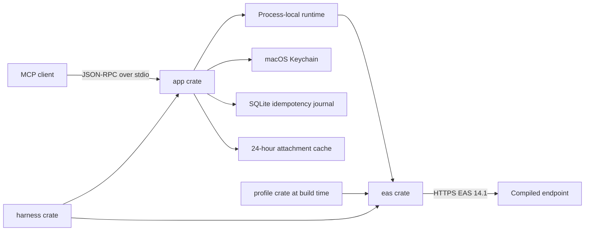

# Architecture

## Runtime shape

Each MCP client launches its own server process. There is no daemon or shared
mailbox cache. FolderSync keys, collection SyncKeys, item references, cursors,
previews, and calendar objects exist only in that process.

## Dependency direction

Runtime direction is `app -> eas`; test direction is `harness -> app + eas`.
The `profile` crate is used by `eas/build.rs` and `xtask`, not as a runtime
configuration loader. Production crates expose no fake URL or TLS bypass.

Traits exist only for EAS transport, clock, ID generation, Keychain, operation
journal, and account backend boundaries. WBXML and domain transformations are
pure functions with concrete types.

## Compile-time profiles

`eas/build.rs` reads the selected profile bundle, verifies it with the shared
profile crate, copies approved PEM bytes to `OUT_DIR`, and generates immutable
Rust tables. Runtime account TOML stores a validated `ProfileKey`; lookup can
only resolve a profile compiled into that binary.

The bundle version and SHA-256 hash are available through `--version --verbose`
and `doctor`. Editing the source profile after compilation has no effect on an
existing binary.

## EAS state

The process runs `OPTIONS`, `Provision`, and `FolderSync`, then synchronizes mail
and calendar collections. Mail uses policy-capped `FilterType=5`; calendar uses
policy-capped `FilterType=6`. Pages are consumed until `MoreAvailable`
disappears, including empty intermediate pages.

Each collection owns its SyncKey. An invalid key resets only that collection.
`Add`, `Change`, `Delete`, and `SoftDelete` are applied in wire order. A missing
field preserves the old value; a present empty field clears it.

List and search results become immutable RAM snapshots for 15 minutes, with at
most 32 snapshots. Search always uses EAS Search. Full bodies and attachments
use ItemOperations only on demand.

## Persistent state

- Keychain: password, Device ID, policy state, and operation HMAC key.
- TOML: profile key, email, username, enabled state, and write permission.
- SQLite: operation UUID, account, kind, payload HMAC, EAS ClientId, state, and
  timestamps. No mailbox content is stored.
- Cache: explicitly requested attachments, mode 0600, removed after 24 hours.

## MCP contract

All tool results use `data`, `error`, and `warnings`. One account may fail while
another returns data. Limits are 100 records, 500-character previews, 12,000
body characters by default, and 50,000 maximum. Calendar is read-only. Four mail
writes require durable idempotency state before the EAS request.
