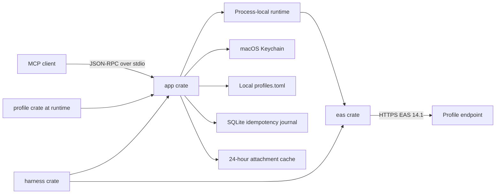

# Architecture

## Runtime shape

Each MCP client launches its own server process. There is no daemon or shared
mailbox cache. Mail FolderSync keys, collection SyncKeys, item references,
cursors, previews, and Calendar Search references exist only in that process. The unit of lifetime
is an MCP stdio connection rather than an application: clients that retain
multiple task sessions retain multiple server processes. Closing the transport
ends the process; editing client configuration does not retroactively close an
existing connection.

## Dependency direction

Runtime direction is `app -> eas`; test direction is `harness -> app + eas`.
The `profile` crate parses and validates local endpoint profiles before the app
constructs the EAS runtime. The resulting owned registry is passed through the
runtime and transport. Production crates expose no fake URL or TLS bypass.

Traits exist only for EAS transport, clock, ID generation, Keychain, operation
journal, and account backend boundaries. WBXML and domain transformations are
pure functions with concrete types.

## Runtime profiles

The public binary contains no endpoint metadata. On startup, the app reads the
user-owned `profiles.toml`, validates the whole document, and resolves each
account's `ProfileKey` against that registry. A profile fixes its DNS host,
allowed email domains, identity strategy, optional username realm and hint,
Device ID length, and trust mode. It cannot configure HTTP, ports, paths,
redirects, protocol version, DeviceType, or TLS bypasses.

Schema v1 profile files are normalized to the v2 identity model in memory.
Account config continues to store the canonical Basic Auth username, so this
migration never moves or rewrites Keychain credentials.

The bundle version and SHA-256 hash are available through `--version --verbose`
and `doctor`. Profile replacement is atomic and is rejected when it invalidates
an existing account or changes a Device ID length already in use.

## EAS state

The process starts with `OPTIONS` and `Provision`. `OPTIONS` requires the core
mail read command set; compose commands are capability-gated and their absence
leaves the account read-only. `ResolveRecipients` is optional: its absence does
not block setup or mail, and availability tools return `FEATURE_UNAVAILABLE`.

Mail uses FolderSync and policy-capped `FilterType=5`. A default `mail_list`
synchronizes Inbox and Sent; explicit `folder_ids` select other mail
collections, and `sync_now` refreshes every mail collection. Pages are consumed
until `MoreAvailable` disappears, including empty intermediate pages.

Each collection owns its SyncKey. An invalid key resets only that collection.
`Add`, `Change`, `Delete`, and `SoftDelete` are applied in wire order. A missing
field preserves the old value; a present empty field clears it.

Mail list and search results become immutable RAM snapshots for 15 minutes, with
at most 32 snapshots. Mail Search always uses EAS Search. Full bodies and
attachments use ItemOperations only on demand.

Calendar availability does not use FolderSync or Sync. Each request calls
`ResolveRecipients + Availability`; a 31-day input is divided into requests of
at most seven days, and 30-minute free/busy digits are clipped to explicit local
working hours. Timezone, DST validation, status merging, and common-window
intersection are pure Rust transformations. No availability cache is retained.
Subjects and bodies from other people's meetings are never requested.

Text own-calendar lookup uses `Search` with `Class=Calendar`. A date-range lookup
instead performs a fresh, bounded, metadata-only Calendar Sync because EAS 14.1
Search has no event-start predicate. The runtime expands Gregorian recurrence
patterns and exceptions with the event's EAS timezone, filters a maximum 31-day
range, sorts it, and emits at most 100 compact summaries. No Calendar body or
snapshot is retained. Compact results receive 15-minute process-local references;
`calendar_get` fetches one item through ItemOperations.

Calendar lifecycle mutations resolve one referenced item through ItemOperations,
then use Calendar `Sync/Add`, `Change`, or `Delete`. A collection SyncKey is
initialized without requesting changes. If ItemOperations omits mutable IDs, a
bounded metadata-only `FilterType=6` Sync scan discards every event except the
matching UID. Invalid keys reset only that Calendar collection. Organizer
notifications and attendee replies are plain-text plus `text/calendar` MIME
sent through EAS SendMail; responses also use MeetingResponse. For servers that
do not auto-create tentative items from external invitations, mail Search and
ItemOperations expose the request metadata and the opaque Search LongId is sent
directly to MeetingResponse. Collection and request IDs are deliberately omitted
on that protocol path.

Every mail or calendar write takes a per-account advisory file lock shared by
independent stdio processes. Multi-step Calendar operations checkpoint a
content-free completed-step bit mask. A safe failure after an earlier success is
`partial`; an ambiguous network outcome is `unknown`. Neither state is retried
with a new UUID automatically.

## Persistent state

- Keychain: password, Device ID, policy state, and operation HMAC key.
- Profile TOML: endpoint metadata and optional public trust certificate.
- TOML: profile key, email, username, enabled state, and write permission.
- SQLite: operation UUID, account, kind, payload HMAC, EAS ClientId, state,
  completed-step bit mask, and timestamps. No mailbox content is stored.
- Cache: explicitly requested attachments, mode 0600, removed after 24 hours.

## MCP contract

All tool results use `data`, `error`, and `warnings`. One account may fail while
another returns data. Mail limits are 100 records, 500-character previews,
12,000 body characters by default, and 50,000 maximum. Availability accepts 20
participants and 31 days, has 30-minute precision, and fails rather than
truncating above 256 KiB. The contract exposes 13 read tools, four mail writes,
and five non-recurring Calendar writes. All mutations require account opt-in and
durable idempotency state before the first external side effect. An explicit
write-tool call validates and executes immediately; draft or review workflows
remain in the agent and must not call the mutation tool.
